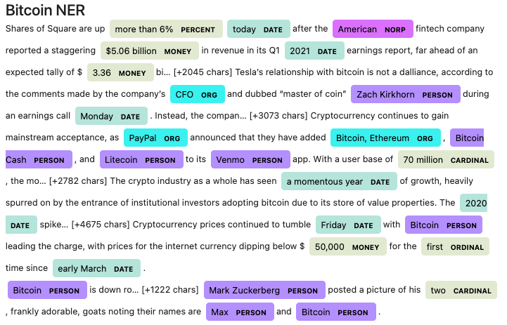
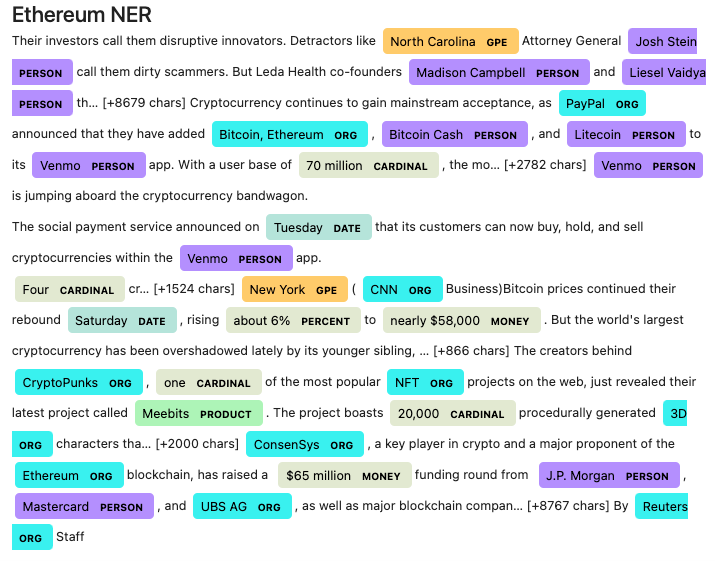

# Natural-Language-Processing

---

### 1 - Sentiment Analysis

Answer to the following questions:

> Q: Which coin had the highest mean positive score?

> A: Bitcoin had the highest mean positive score. Because Bitcoin and Ethereum mean positive scores are 0.056220 and 0.048610, respectively.

> Q: Which coin had the highest compound score?

> A: Ethereum had the highest compound score. Because Bitcoin and Ethereum max compound scores are 0.817600 and 0.827100,respectively.

> Q. Which coin had the highest positive score?

 >A: Bitcoin had the highest positive score. Because Bitcoin and Ethereum max positive scores are 0.269000 and 0.256000, respectively.

---

### 2 - Natural Language Processing

Please review crypto_sentiment file for details. 

#### Word Clouds

---

### 3 - Named Entity Recognition

---
