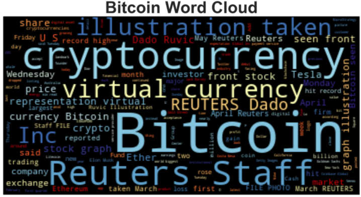
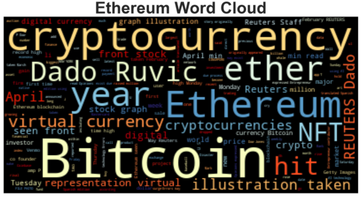

# Natural-Language-Processing
Sentiment Analysis and Natural Language Processing for Bitcoin and Ethereum

## Background

There's been a lot of hype in the news lately about cryptocurrency, so I took a stock, so to speak, of the latest news headlines regarding Bitcoin and Ethereum to get a better feel for the current public sentiment around each coin.

I applied natural language processing to understand the sentiment in the latest news articles featuring Bitcoin and Ethereum. I also applied fundamental NLP techniques to better understand the other factors involved with the coin prices such as common words and phrases and organizations and entities mentioned in the articles.

Completed tasks:

1. [Sentiment Analysis](#Sentiment-Analysis)
2. [Natural Language Processing](#Natural-Language-Processing)
3. [Named Entity Recognition](#Named-Entity-Recognition)

---
### Sentiment Analysis

Used the [newsapi](https://newsapi.org/) to pull the latest news articles for Bitcoin and Ethereum and create a DataFrame of sentiment scores for each coin.

### Natural Language Processing

In this section, I used NLTK and Python to tokenize the text for each coin, and :

1. Lowercase each word
2. Remove punctuation
3. Remove stop words

Next, looked at the ngrams and word frequency for each coin.

1. Used NLTK to produce the ngrams for N = 2.
2. Listed the top 10 words for each coin.

Finally, generated word clouds for each coin to summarize the news for each coin.

---

#### Named Entity Recognition
 Build a named entity recognition model for both coins and visualize the tags using SpaCy.

---
